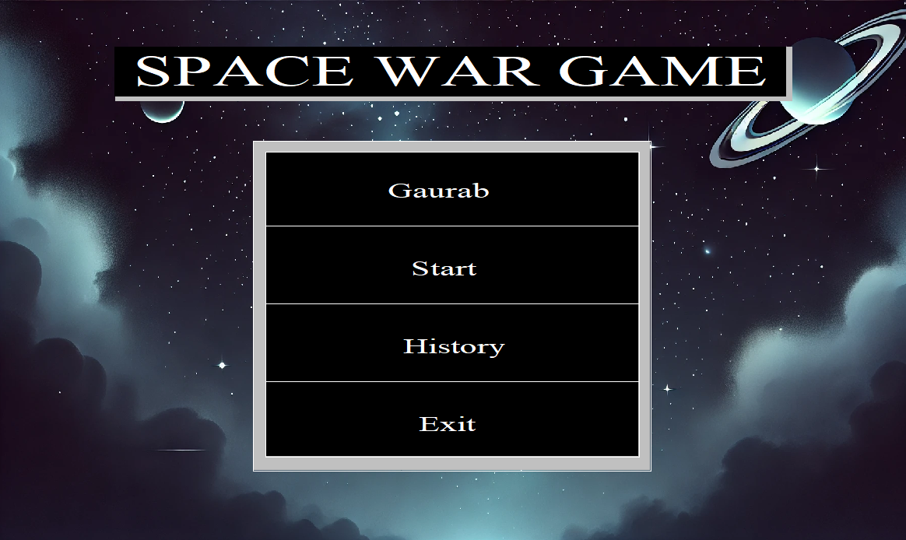
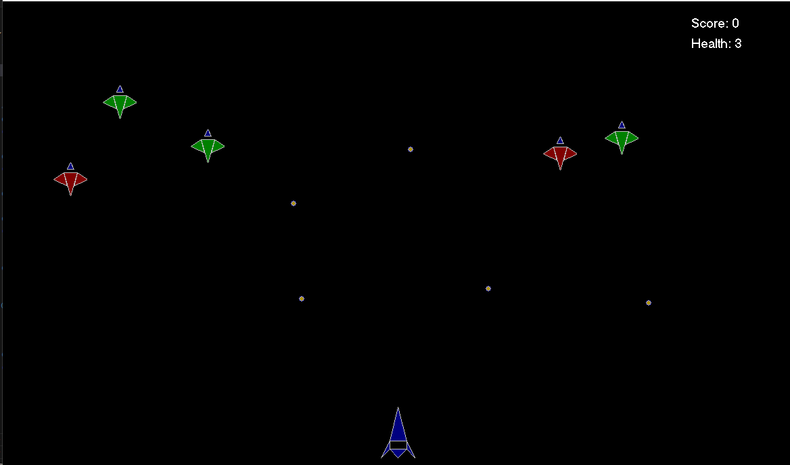
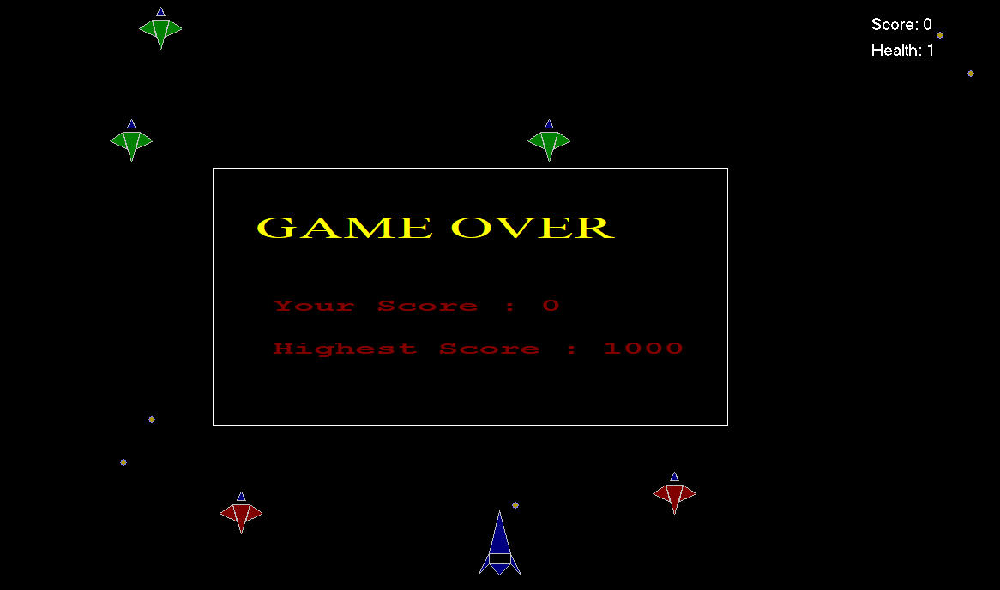
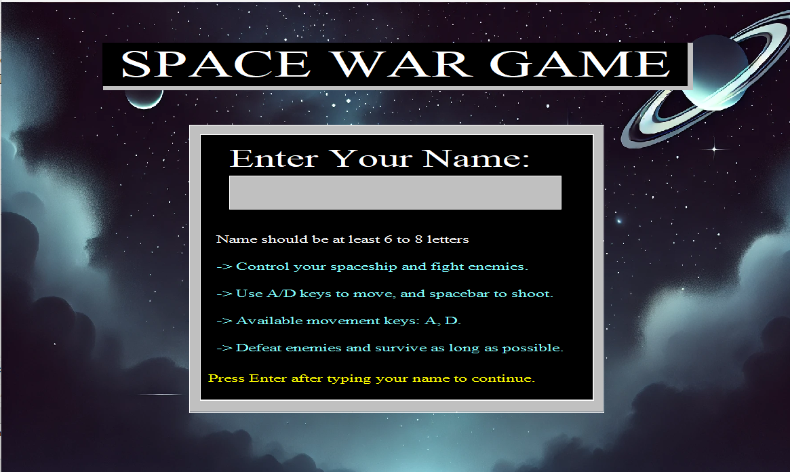
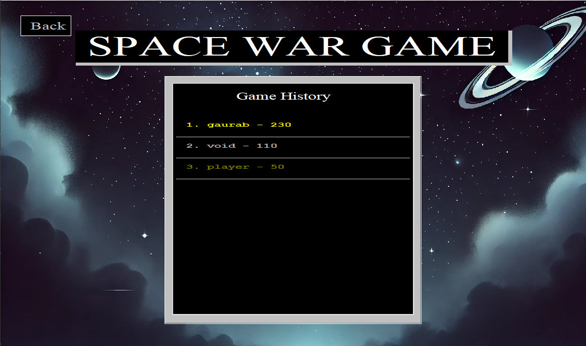

# 🚀 Space War Game

A simple 2D space war game built using **C** and **graphics.h** library.  
The game features enemies, bullets, player health, score system and history tracking.

---

## 🎮 Features
- Spaceship controlled by the player.
- Game mechanics:
  - Arrows key for moment.
  - Space for shooting.
- Enemies of two types:
  - Horizontal movement .
  - Spawning from top and moving downwards.
- Bullets:
  - Player bullets destroy enemies.
  - Random "sky bullets" for extra challenge.
- Health system (3 HP).
- Score increases when enemies are destroyed.
- History system that saves scores to `history.txt`.
- Multiple UI screens:
  - **User Menu**
  - **Game Screen**
  - **History Screen**
  - **Game Over Screen**
  - **Name Input Screen**

---

## 🖼️ Screenshots

| User Menu | Game Screen | Game Over |
|-----------|-------------|-----------|
|  |  |  |

| Name Input | History | Background |
|------------|---------|-------------|
|  |  |  |

---

## ⚙️ Installation & Run

### Prerequisites
- Windows OS (tested)
- C++ compiler
- **WinBGIm / graphics.h** library installed

### Steps
# Clone repository
```
git clone https://github.com/your-username/space_war_game.git
cd space_war_game
```

# Compile
```
g++ main.cpp userui.cpp gameui.cpp fileop.cpp collision.cpp -o space_war_game -lbgi -lgdi32 -lcomdlg32 -luuid -loleaut32 -lole32
```

# Run
```
./space_war_game
or 
double click on .dev (if on dev-C++ IDE)
```

----

## 📂 Project Structure
```
├── main.cpp              # Entry point
├── userui.cpp/.h         # User menu UI
├── gameui.cpp/.h         # Game interface
├── fileop.cpp/.h         # File I/O (history, scores)
├── collision.cpp/.h      # Collision detection
├── history.txt           # Saved scores
├── assets/               # Game images (BMP, PNG)
├── semester_project.exe  # Windows executable
```

---

## 🛠️ Development Notes

    Developed as a semester project.
    Code written in C++ (but using C-style in places).
    UI and rendering powered by graphics.h.

----

## 🙌 Credits

Developed by Gaurab Aryal
(With guidance, learning, and experimentation in graphics programming)